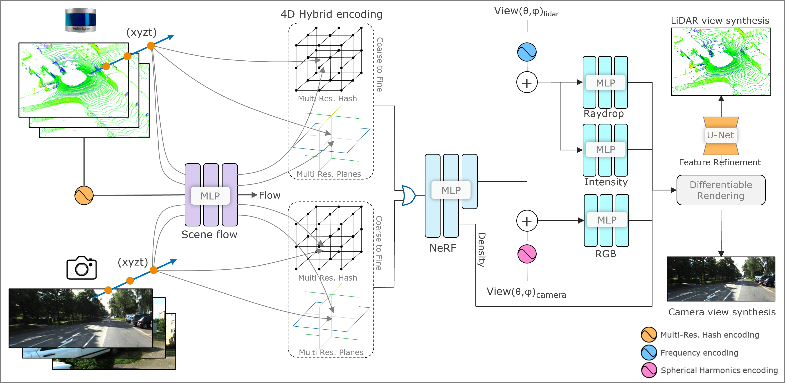
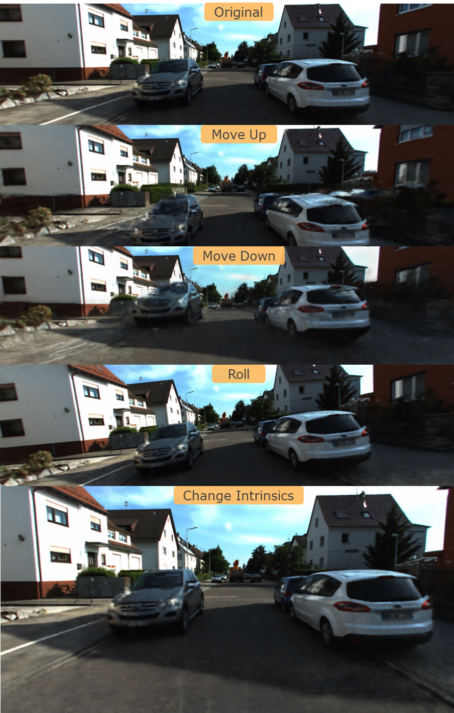

<div align="center">

<h2>Self-Supervised Multimodal NeRF for Autonomous Driving (NVSF)</h2>  

<h1></h1>

**[Project Page](https://gaurav00700.github.io/ProjectPage-Selfsupervised-NVSF/) | [Paper (arXiv)](https://arxiv.org) | [Video](https://youtu.be/MlZFP5wc1Lc)**

</div>

## Introduction

This repo is containing the code of Self-Supervised Multimodal NeRF for Autonomous Driving (NVSF).

1. Novel views for LiDAR and Camera at Spatio-temporal coordinate.
2. Multimodality training for joint learning of LiDAR and Camera fields.
3. Heuristic based image pixel sampling.
4. Improved feature alignment for LiDAR point cloud.
5. Novel view synthesis of LiDAR and Camera for custom sensor intrinsic and extrinsic parameters.

## Artifacts of synthesized PCD and Image

Point Cloud NVS           |  Image NVS
:-------------------------:|:-------------------------:
  |  

<!-- ### Artifacts of synthesized PCD
 -->


## TODO
 1. [ ] Add experiments result

## Installation
### 1. Prepare the environment
```bash
# Clone the repo and CD to repo
git clone --recursive https://github.com/gaurav00700/Selfsupervised-NVSF.git && cd Selfsupervised-NVSF

#Create and activate the Python environment
conda create -n nvsf python=3.9 -y && conda activate nvsf
```
### 2.  Packages installation
* OPTION 1: Using setup for CUDA 11.8 (This will take a while)
```bash
python setup.py develop
```

* OPTION 2: Manual installation for custom CUDA version
```bash
# Torch 2.1.2 with CUDA 11.8
pip install torch==2.1.2+cu118 torchvision==0.16.2+cu118 --extra-index-url https://download.pytorch.org/whl/cu118

# Instally cuda-toolkit locally for cuda extensions (use CUDA_HOME=CONDA_PREFIX)
conda install -c "nvidia/label/cuda-11.8.0" cuda-toolkit

# Dependencies
pip install -r requirements.txt

# Install tiny-cuda-nn  (This may take a while, refer to the official documentation)
pip install ninja git+https://github.com/NVlabs/tiny-cuda-nn/#subdirectory=bindings/torch

# Build torch extensions
pip install nvsf/nerf/raymarching nvsf/nerf/chamfer3D

# Install nvsf
pip install -e .
```

### 3. Verify installation
```bash
python -c "import nvsf; print(nvsf.__version__)"
```

## Experiments on KITTI-360 dataset

### 1. Download the dataset [here](https://www.cvlibs.net/datasets/kitti-360/index.php) put the dataset into `nvsf/data/kitti360/source_data` as shown below.

```bash
nvsf
└──data
    └── kitti360
        └── source_data
            ├── calibration
            ├── data_2d_raw
            ├── data_2d_semantics
            ├── data_3d_bboxes
            ├── data_3d_raw
            └── data_poses
```
### 2. Preprocess the dataset
* Run the following command to generating Pano images, scene jsons and configs file (saved at nvsf/configs)
* We use the sequence `2013_05_28_drive_0000_sync` for all the experiments
```bash
python nvsf/scripts/preprocess_data.py --dataset kitti360 --sequence_name 1908
```

* After preprocessing, your folder structure should look like this:

```bash
nvsf
└──data
    └── kitti360
        ├── source_data
        │   ├── calibration
        │   ├── data_2d_raw
        │   ├── data_2d_semantics
        │   ├── data_3d_bboxes
        │   ├── data_3d_raw
        │   └── data_poses
        ├── train
        │   ├── sequence_name
        │   │   ├── 00001.npy
        │   │   ├── ...  .npy
        │   │   ├── transforms_{sequence_id}test.json
        │   │   ├── transforms_{sequence_id}train.json
        │   │   ├── transforms_{sequence_id}val.json
        │   │   └── transforms_{sequence_id}all.json
```

### 3. Training

```bash
python nvsf/scripts/main_nvsf.py --config nvsf/configs/kitti360_1908.txt
```

### 4. Track training using Tensorboard
```bash
tensorboard --logdir=./nvsf/log/kitti360
```

### 5. Validation

```bash
python nvsf/scripts/main_nvsf.py --config nvsf/configs/kitti360_1908.txt --ckpt latest --test_eval
```

## Extras
* Reduce the batch size of `--num_rays` and `--num_rays_lidar` to solve CUDA out of memory error
* Network was trained on a single Nvidia v100 GPU

## Acknowledgments
This code is built on top of the [Lidar_nerf](https://github.com/tangtaogo/lidar-nerf) and [LiDAR4D](https://github.com/ispc-lab/LiDAR4D.git) codebases.

```bibtex
@article{tao2023lidar,
    title   = {LiDAR-NeRF: Novel LiDAR View Synthesis via Neural Radiance Fields},
    author  = {Tao, Tang and Gao, Longfei and Wang, Guangrun and Lao, Yixing and Chen, Peng and Zhao hengshuang and Hao, Dayang and Liang, Xiaodan and Salzmann, Mathieu and Yu, Kaicheng},
    journal = {arXiv preprint arXiv:2304.10406},
    year    = {2023}
}
```

```bibtex
@inproceedings{zheng2024lidar4d,
  title     = {LiDAR4D: Dynamic Neural Fields for Novel Space-time View LiDAR Synthesis},
  author    = {Zheng, Zehan and Lu, Fan and Xue, Weiyi and Chen, Guang and Jiang, Changjun},
  booktitle = {Proceedings of the IEEE/CVF Conference on Computer Vision and Pattern Recognition (CVPR)},
  year      = {2024}
  }
```

